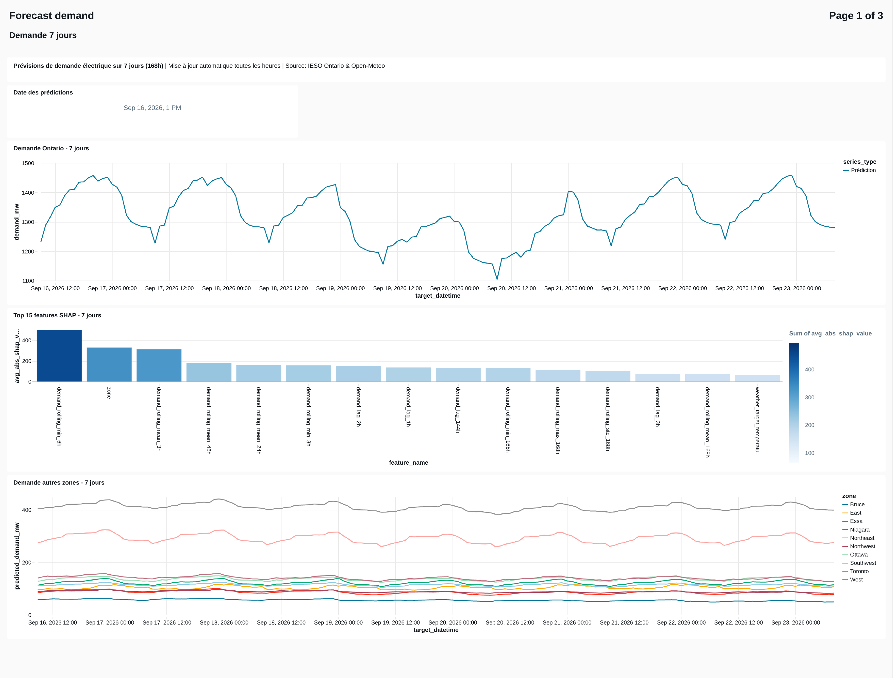
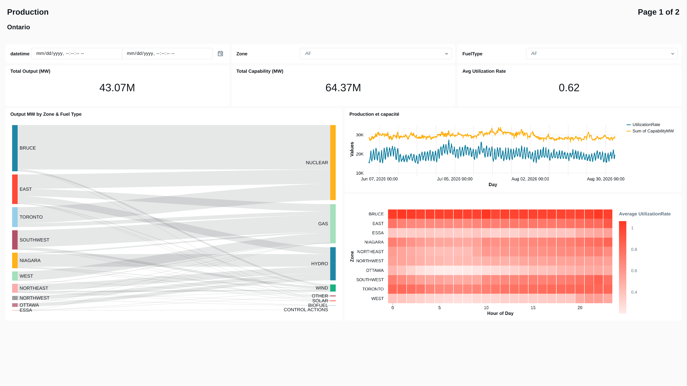

# 🔌 Ontario Energy Demand Forecasting

**End-to-end ML pipeline on Databricks that forecasts Ontario's electricity demand by zone, at two horizons (24h and 7 days), and serves the results through live dashboards.**

[](https://www.python.org/)
[](https://databricks.com/)
[](https://lightgbm.readthedocs.io/)
[](https://mlflow.org/)

Built solo to practice production-style MLOps: a medallion architecture in Unity Catalog, two direct multi-horizon forecasting models (24h and 7 days), SHAP-based explainability, scheduled batch inference and monitoring — all orchestrated as Databricks Jobs.

---

## 🎯 What it does

Ingests hourly Ontario electricity demand and weather data, engineers time-series features, and trains two LightGBM models — both using a **direct multi-horizon** strategy where `forecast_horizon_hours` is a model input (no recursive loop):

| Model | Horizon | Training | Inference |
|-------|---------|----------|-----------|
| **24h** | H+1 to H+24 | `06_train_model_24h` (notebook) | `09_batch_prediction_24h.py` |
| **7 days (168h)** | H+1 to H+168 | `07_train_model_7j` (notebook) | `09b_batch_prediction_7j.py` |

**Data sources:** IESO (demand + generation/capacity), Weather.gc.ca (historical, training) & Open-Meteo (forecasts, inference), Ontario calendar/holidays.

Both models log to MLflow, register in Unity Catalog, and run on a schedule via Databricks Jobs. A daily morning job builds the features and scores both models; predictions and SHAP values feed the Lakeview dashboards below.

---

## 📊 Dashboards

**Forecast demand** — 7-day and 24h forecasts, SHAP top drivers, daily peaks & troughs analysis:


**Production** — generation & capacity by zone/fuel type, utilization rate:


Dashboard source files: [`dashboards/`](dashboards/) (`.lvdash.json`, importable into Databricks Lakeview).

---

## 🏗️ Architecture

```
IESO API · Weather.gc.ca · Open-Meteo
                │
                v
🥉 BRONZE  (energy_forecast_bronze)   raw demand, zonal demand, weather
                │
                v
🥈 SILVER  (energy_forecast_silver)   demand + weather, cleaned & joined
                │
        ┌───────┴───────┐
        v               v
🥇 GOLD — 24h        🥇 GOLD — 7j        (both: energy_forecast_gold)
features · forecast · SHAP    features · forecast · SHAP
        └───────┬───────┘
                v
🎯 MONITORING   model_performance — MAE/RMSE/MAPE by zone & horizon
```

Unity Catalog uses one schema per medallion layer rather than a flat schema, to keep permissions and lineage aligned with Bronze/Silver/Gold. Full table-by-table detail: [`docs/architecture.md`](docs/architecture.md).

**Feature engineering:** lags (1h–336h), rolling stats (3h–168h windows), calendar/cyclical encoding, weather + degree-days. SHAP values are persisted per prediction and power the "top drivers" charts above.

---

## 📂 Project structure

```
pipeline/
├── bronze/     01_ingest_ieso_demand.py, 02_ingest_weather_historical.py
├── silver/     03_join_demand_weather.py
├── gold/       04_build_features.py, 04_build_features_7j.py, 05_feature_selection.py
├── modeling/   06_train_model_24h, 07_train_model_7j  (Databricks notebooks)
├── inference/  08_build_prediction_features.py, 08b_build_prediction_features_7j.py,
│               09_batch_prediction_24h.py, 09b_batch_prediction_7j.py
└── monitoring/ 10_model_evaluation  (Databricks notebook)

config/    config.yaml, zones_config.py, selected_features.yaml
utils/     holidays_ontario.py, weather_utils.py, feature_utils.py
docs/      architecture.md, images/
dashboards/  Lakeview .lvdash.json files
```


---

## 🚀 Quick start

Requires a Databricks workspace with Unity Catalog and Python 3.10+ (see [`requirements.txt`](requirements.txt) for Python dependencies). The project path is set via env var `ENERGY_FORECAST_PROJECT_ROOT`; everything else (tables, hyperparameters, job schedules) lives in `config/config.yaml`.

```bash
pipeline/bronze/01_ingest_ieso_demand.py      # ingest (+ 02_ingest_weather_historical.py)
pipeline/silver/03_join_demand_weather.py         # clean & join
pipeline/gold/04_build_features_24h.py             # features (+ 04_build_features_7j.py)
pipeline/modeling/06_train_model_24h                # train (+ 07_train_model_7j)
pipeline/inference/09_batch_prediction_24h.py       # score (+ 09b_batch_prediction_7j.py)
pipeline/monitoring/10_model_evaluation             # evaluate
```

In production this runs as scheduled Databricks Jobs: ingestion and processing every 6h, weekly retraining (Sunday 03h), forecasting every morning (24h at 01h/07h/13h/19h, 7j at 02h/14h), daily evaluation at 02h.

---

## 📚 Documentation

- [`docs/architecture.md`](docs/architecture.md) — Unity Catalog tables, data flow & technical implementation notes
- [`CHANGELOG_CLEANUP.md`](CHANGELOG_CLEANUP.md) — cleanup history
